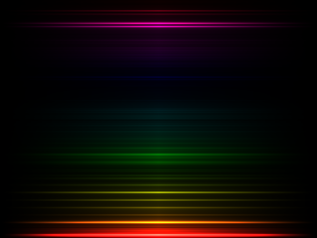

# fft shader fader

just found [bonzomatic](https://github.com/Gargaj/Bonzomatic) and wondered how to use its [fft](https://en.wikipedia.org/wiki/Fast_Fourier_transform) and [midi](https://en.wikipedia.org/wiki/MIDI)... this simple [shader](https://en.wikipedia.org/wiki/Shader#Pixel_shaders) should draw the input audio frequencies in horizontal lines, coloring them through [hsv](https://en.wikipedia.org/wiki/HSL_and_HSV) colors from top (high freq) to bottom (low freq):

and use following midi fader/knob channels to modify the live drawing:
- 1 : minimum frequency
- 2 : maximum frequency
- 3 : horizontal line fadeout

todo

- rotate?
- bend? (so it would look like "vinyl grooves"?)
- buffer? (so i could implement the "visual data smoothing" like in [topsy](https://github.com/oskude/topsy))

ps. bonzomatic only loads [`shader.glsl`](./shader.glsl) from current directory and can't hide the ui from [`config.json`](./config.json), so press `f11` to hide the ui.
